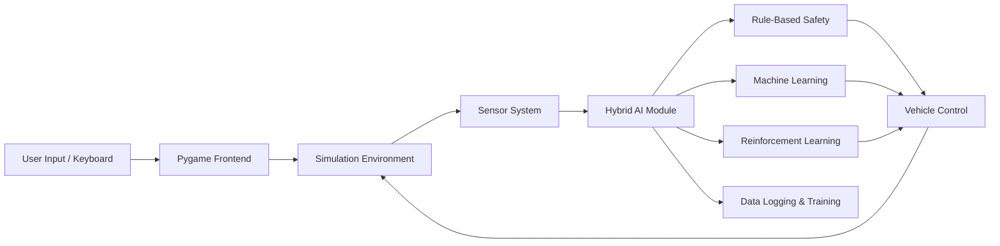
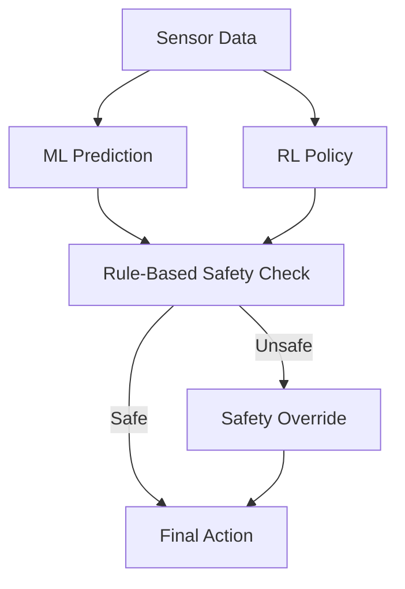

# Hybrid AI Car Driving Simulator
Hybrid Intelligence for Safer Autonomous Driving
A 2D autonomous driving simulator that proves why Hybrid AI (Rules + ML + RL) is safer and more reliable than Pure Machine Learning for autonomous vehicles.

⭐ Designed for academic excellence, AI research, and recruiter visibility
## 🔥 Why This Project Stands Out

 - ❌ Pure ML fails in unseen & risky scenarios

 - ✅ Hybrid AI guarantees safety using rule-based overrides

 - 🧠 Combines Rule-Based Safety + Random Forest + Q-Learning

 - 📊 Clear performance comparison between Hybrid AI and Pure ML

 - 🎮 Real-time 2D simulation using Pygame

Key Insight:
Safety rules must override AI predictions in real-world autonomous systems.

## 🧠 What It Does (In One Minute)

 - Simulates a self-driving car in a 2D environment

 - Uses 7 ray-casting sensors (LIDAR-like perception)

 - Predicts steering & speed using Machine Learning

 - Learns optimal driving via Reinforcement Learning

 - Enforces collision avoidance & traffic rules using rule-based logic

 - Compares Hybrid AI vs Pure ML performance

## ⚙️ Tech Stack

 - Python

 - Pygame – Simulation & rendering

 - Scikit-learn – Random Forest (Classifier + Regressor)

 - Q-Learning – Reinforcement Learning

 - NumPy, Pandas – Data handling

 - Matplotlib – Performance visualization
## 🏗️ System Architecture (High Level)


## 🧩 Hybrid AI Decision Logic


## 📊 Results Snapshot
| Metric            | Hybrid AI   | Pure ML    |
| ---------------   | ---------   | ---------- |
| Collision Rate    | ✅ Low      | ❌ High     |
| Rule Violations   | ✅ Minimal  | ❌ Frequent |
| Stability         | ✅ High     | ❌ Unstable |
| Speed Control     | Balanced   | Aggressive |
| Overall Safety    | ⭐⭐⭐⭐⭐     | ⭐⭐         |


✅ Hybrid AI consistently outperforms Pure ML
## 🚀 Installation & Run
### 🔹 Prerequisites

  - Python 3.8+
 
  - Windows / Linux / macOS

### 🔹 Clone Repository
```bash
git clone https://github.com/your-username/hybrid-ai-car-simulator.git
cd hybrid-ai-car-simulator
```
### 🔹 Install Dependencies
```bash
pip install -r requirements.txt
```
requirements.txt
```text
pygame
numpy
pandas
matplotlib
scikit-learn
joblib
```
### 🔹 Run the Simulator
```bash
python main.py
```
### 🔹 Modes Available
  - 🧑‍✈️ Manual Mode – Collect training data

  - 🤖 Pure ML Mode – ML only (unsafe)

  - 🧠 Hybrid AI Mode – Rules + ML + RL (recommended)
## 🎯 Ideal For
  - Autonomous Driving Projects

  - AI / ML / RL Portfolios

  - College Minor / Major Projects

  - Research Demonstrations

  - Recruiter Evaluation
## 🔮 Future Scope
  - Deep Learning (CNN / DNN)

  - Deep Q-Networks (DQN)

  - 3D Simulation

  - Multi-agent traffic

  - Camera & LIDAR sensors

  - Real-world robotic deployment
## 👨‍💻 Team
  - Ayan Kundu

  - Debarshi Chatterjee

  - Moupiya Das

  - Rohit Saha

🎓 Asansol Engineering College
## ⭐ Final Takeaway
Pure ML is not enough for safety-critical AI.
Hybrid Intelligence is the future of autonomous systems.
